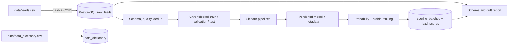

# Lead prioritization for telesales

This repository implements the assignment as a small, reproducible ML system: raw CSV values are ingested idempotently into PostgreSQL, validated and transformed downstream, split chronologically, used to train and evaluate a probability model, and written back as ranked, versioned scoring batches. It is review-ready take-home code, not a claim of full production readiness.

## Quick start

The reproducible Docker path requires Docker, Docker Compose, and Make:

```bash
cp .env.example .env
export LOCAL_UID="$(id -u)"
export LOCAL_GID="$(id -g)"
docker compose up -d db
make pipeline
make check
```

Equivalent commands without Make:

```bash
docker compose up -d db
docker compose build app
docker compose run --rm app uv run --frozen lead-scoring pipeline
docker compose run --rm app uv run --frozen pytest -q
```

For local development with Python 3.12 and [uv](https://docs.astral.sh/uv/), no manual virtual
environment or pip commands are needed:

```bash
uv sync --locked
uv run --frozen ruff format --check .
uv run --frozen ruff check .
uv run --frozen mypy
uv run --frozen pytest -q -m 'not integration'
```

`uv.lock` is the single resolved dependency lock used locally and in Docker.

The normal pipeline is rerunnable. Reingesting identical bytes is a no-op; raw values are never silently duplicated. Each scoring invocation intentionally creates a new immutable batch so score history is retained. Output JSON/CSV files are written to `artifacts/`, PNG charts to `charts/`, and scores to PostgreSQL.

## Business definition and prediction point

A lead becomes eligible immediately after the quote journey is abandoned and the business-defined waiting interval has elapsed. The model runs at that snapshot, before any outbound telesales action and before purchase completion. Available inputs are lead/acquisition attributes, the visible quote and discount, payment choice, prior-customer state, and event-time-bounded behavior through that instant. `Completed Purchase` is the later binary label (1 = purchase completed).

This exact event lineage cannot be proven from a synthetic flat file. The defensible implementation assumption is that `Insurance Company`, `Payment Type`, `Price`, `Discount Percent`, `Incoming Call Last 24h`, and `Expected Margin` are pre-outcome snapshots. Production onboarding must verify source timestamps and point-in-time joins. `Visited Offer Page` is valid because scoring is deliberately after funnel abandonment. The complete per-column decision and rationale is regenerated at `artifacts/feature_availability_audit.csv`.

`Lead ID` is excluded as an identifier/synthetic artifact. The absolute date is excluded to avoid learning a non-generalizable five-month trend, but creation hour and weekday are derived. The outcome is direct leakage and is never passed to preprocessing or scoring.

## Data findings and decisions

The input has 50,180 rows, 22 columns, and 4,605 purchases (9.18%). It covers 2026-04-01 through 2026-08-28. Missingness is limited to City (936), Price (930), and Discount Percent (542); it is handled inside fitted pipelines. Negative `Days To Policy Expiry` values are retained as plausibly already-expired policies. Broad validation bounds catch impossible values while product-dependent price and margin tails are retained.

There are no exact duplicate rows, but 180 IDs appear twice. Each is a synthetic near-copy whose creation time differs by minutes and whose target agrees. Raw staging preserves all 50,180 rows; modeling and scoring sort stably and keep the earliest record per `Lead ID`, yielding 50,000 unique examples. A customer ID does not exist, so customer-grouped splitting cannot be performed. The structured quality report, including missingness, ranges, cardinality, rare categories, outcome screens, and synthetic-pattern warnings, is regenerated at `artifacts/data_quality_report.json`.

## Architecture and data flow



The repository keeps source inputs, documentation, generated outputs, infrastructure, and
application code separate:

```text
.
├── data/                    immutable source CSV files
├── docs/                    original assignment PDF
├── src/lead_scoring/        application package
│   ├── cli.py               argument parsing and error boundary
│   ├── workflow.py          application-stage orchestration
│   ├── config.py            environment-backed settings
│   ├── database.py          PostgreSQL ingestion and score persistence
│   ├── data/                dataset preparation, splitting, audit, and quality analysis
│   ├── artifacts.py         validated model and monitoring artifact contracts
│   ├── modeling.py          sklearn preprocessing and candidates
│   ├── training.py          model selection, training, and final evaluation
│   ├── metrics.py           capacity metrics, lift, and uncertainty
│   ├── evaluation.py        segment reports and deterministic charts
│   ├── scoring.py           stable ranking and capacity policy
│   └── monitoring.py        schema, drift, score, and label checks
├── tests/                   unit and PostgreSQL integration tests
├── sql/001_init.sql         idempotent database schema
├── artifacts/               generated model and machine-readable reports
├── charts/                  generated analytical and evaluation charts
├── Dockerfile
├── compose.yaml
├── Makefile
└── pyproject.toml
```

The CLI only parses a command, loads Pydantic-validated settings, invokes the workflow, and translates
failures to a nonzero exit. Core transformations accept explicit DataFrames/configuration and do
not read environment variables or touch PostgreSQL. Small Pydantic artifact and score-batch models make the
cross-module schemas explicit without adding repository/service interfaces with one implementation.

## Features and preprocessing

Numeric features use training-only median imputation and missingness indicators, with standardization for logistic regression. Categoricals use training-only most-frequent imputation and one-hot encoding with unknown/rare handling for the linear model. The tree candidates use an unknown-safe ordinal representation. No resampling or class weighting is used: both can alter the meaning of probabilities, while ranking metrics directly address the 9% outcome rate. All transforms live inside a persisted scikit-learn `Pipeline`, preventing train/validation leakage and train/serve skew.

The comparison is intentionally bounded: prevalence dummy, regularized logistic regression, random forest, gradient boosting, and histogram gradient boosting, all with fixed settings. The primary selection metric is validation average precision (PR-AUC), because telesales cares about concentrating purchases in a small contacted set. A documented simplicity rule selects logistic regression when it is within 0.01 AP and log loss of the leader. Probability quality is considered via log loss and Brier score; no post-hoc calibration was applied because the logistic model was already reasonably calibrated and calibration would require another clean holdout.

A conservative sensitivity run removes all timing-questionable fields (`Insurance Company`, `Payment Type`, `Price`, `Discount Percent`, `Incoming Call Last 24h`, and `Expected Margin`). Its validation AP is 0.1785 versus 0.1934 for the full logistic model (log loss 0.2806 versus 0.2781). The modest, distributed improvement does not look like a single direct leak, but production use remains conditional on confirming those fields' point-in-time lineage. The exact comparison is persisted in model metadata.

## Validation and evaluation

Rows are ordered by `Created At` and assigned 70%/15%/15% to train, validation, and final test using timestamp boundaries (equal timestamps cannot cross a boundary). Duplicate business keys are removed first, and split reports explicitly verify zero Lead-ID overlap. The validation set selects the model and the probability cutoff corresponding to 10% calling capacity. The final test is accessed only by `evaluate`, after those choices are frozen.

Metrics include prevalence, average precision, ROC-AUC, log loss, Brier score, precision/recall/F1 and confusion matrix at the validation capacity cutoff, top-1/5/10/20% precision, recall, and lift, plus 200 deterministic bootstrap samples for AP/ROC-AUC uncertainty. Data-quality reporting includes three focused EDA views.

## Experiment tracking

MLflow stores one run for each candidate model. Every run contains the estimator parameters,
training-data hash, validation metrics, and fitted scikit-learn pipeline. The selected run is recorded
in `model_metadata.json`; final test metrics are added to that run by `evaluate`. Start the local
comparison UI after training with:

```bash
make mlflow-ui
```

Then open <http://localhost:5000>. MLflow state is persisted in the `mlflow_data` Docker volume.

## Prioritization and PostgreSQL

The policy does not invent semantic probability bands: sort by descending `purchase_probability`, break exact ties by ascending `lead_id`, and mark exactly the top `ceil(batch_size * TOP_FRACTION)` as `call`; the remainder is `backlog`. Change `TOP_FRACTION` to match measured daily capacity. Every row carries UTC `scored_at`, model version, batch UUID, and the maximum source event time as `data_as_of`.

The raw table uses `(source_hash, source_row_number)` as its key, preserving duplicated source rows and original strings. `scoring_batches` records status/lineage and `lead_scores` is append-only by batch with probability checks, unique ranks, and a covering top-N index. Retrieve the latest successful batch with:

```sql
SELECT s.lead_id, s.purchase_probability, s.priority_rank, s.priority_tier,
       s.scored_at, s.model_version, s.scoring_batch_id, s.data_as_of
FROM lead_scores AS s
JOIN scoring_batches AS b USING (scoring_batch_id)
WHERE b.status = 'succeeded'
  AND b.scoring_batch_id = (
      SELECT scoring_batch_id FROM scoring_batches
      WHERE status = 'succeeded'
      ORDER BY completed_at DESC, scoring_batch_id DESC
      LIMIT 1
  )
ORDER BY s.priority_rank
LIMIT 20;
```

The supplied file labels every historical row, so scoring all deduplicated records is only a demonstration. A real job must select unresolved, still-eligible leads at the scoring point; it must not expose their eventual labels. The scoring code never selects the target into its input matrix.

Scoring accepts a feature-only batch and does not require it to have the training source hash. The
artifact retains the training-source hash, while each PostgreSQL scoring batch records the source
hash actually scored. This preserves both lineages and allows the trained pipeline to score later
eligible batches. Score rows and batch metadata are validated together before a transaction begins.

## Commands and reproducibility

Each stage returns nonzero on failure and can be run separately:

```bash
docker compose run --rm app uv run --frozen lead-scoring init-db
docker compose run --rm app uv run --frozen lead-scoring ingest
docker compose run --rm app uv run --frozen lead-scoring quality
docker compose run --rm app uv run --frozen lead-scoring train
docker compose run --rm app uv run --frozen lead-scoring evaluate
docker compose run --rm app uv run --frozen lead-scoring score
docker compose run --rm app uv run --frozen lead-scoring monitor
```

`make format`, `make lint`, `make typecheck`, and `make test` run the corresponding checks in the
container; `make format-fix` applies formatting and `make check` runs the complete check set.
Configuration is loaded once from the environment and rejects empty credentials/paths, invalid
ports/seeds, and invalid capacity fractions before database or model work begins. PostgreSQL
connection establishment alone has three short exponential-backoff attempts with jitter; schema,
data, SQL, artifact, and model failures are never retried.

The artifact contains the complete pipeline and a validated format/schema contract. Metadata records a deterministic version from source/config hashes, source SHA-256, training UTC timestamp, feature/schema contract, fixed seed, dependency versions, split evidence, validation comparison, capacity cutoff, monitoring baseline, and test metrics. Same data/configuration therefore produce the same version and model predictions (timestamps and new scoring batch IDs naturally differ).

## Monitoring

`monitor` reruns schema/range validation and emits `artifacts/monitoring_report.json`. It reports missingness deltas, unseen categories, out-of-training-range values, feature PSI, prediction PSI, volume/failures, and delayed AP/Brier when labels can be joined. Initial warnings are PSI > 0.20, absolute missing-rate delta > 5 percentage points, unseen-category rate > 1%, or >1% outside the training range. These are transparent starting assumptions to tune against production alert volume. The immediate label join in this static assignment is explicitly marked as demonstration-only.

## Security, privacy, and operational limits

Credentials are environment variables; `.env` and database volumes are ignored. SQL values are parameterized and raw values are not logged. The application image runs as a non-root user. In production, use a secret manager, TLS, least-privilege roles, encrypted backups, retention/deletion policies, audit logs, and access controls because behavioral and location fields can be personal data.

This take-home lacks customer identity, contact eligibility/consent, label-maturity timestamps, intervention history, business contact cost/value, and true online feature lineage. It cannot test customer leakage, causal uplift, or real temporal drift. Synthetic patterns may overstate generalization.

## Future plans

With more time and access to real source systems, improvements should be made in this order.

### 1. Establish trustworthy point-in-time data

- Add event timestamps and ownership documentation for every feature, especially payment, discount, insurer, inbound-call, and margin fields.
- Introduce a stable customer identifier so repeated customers can be kept within one validation partition.
- Define lead eligibility, consent, suppression, purchase-label maturity, cancellation, and refund rules with Sales and Product.
- Replace full CSV loads with incremental, audited source ingestion and explicit schema versions.
- Add historical point-in-time reconstruction tests to prove that offline and online feature values agree.

These changes have priority over model tuning because a more complex model cannot compensate for an incorrect prediction-time snapshot.

### 2. Improve the decision policy and model evidence

- Run rolling-origin temporal backtests across several seasonal periods instead of relying on one five-month sample.
- Evaluate expected business value using contact cost, expected margin, agent capacity, and downstream cancellation—not conversion alone.
- Compare the current probability ranking with an expected-value ranking once margin quality is verified.
- Reassess calibration on a dedicated recent calibration window and calibrate only when it improves out-of-time probability quality.
- Evaluate uplift or treatment-effect models after randomized or defensibly logged contact/no-contact outcomes become available. The current model estimates purchase propensity, not incremental impact from a call.
- Add fairness and service-quality reviews across sufficiently large, business-approved segments before using sensitive or proxy attributes operationally.

### 3. Harden deployment and monitoring

- Add CI for unit tests, PostgreSQL integration tests, image builds, vulnerability scanning, and deterministic pipeline smoke tests.
- Register approved artifacts with promotion status, immutable configuration, training lineage, and rollback support.
- Schedule ingestion, scoring, delayed-label evaluation, and monitoring with the company's existing orchestrator rather than introducing a new platform solely for this model.
- Monitor eligibility volume, score and feature drift, calibration, precision/lift at actual call capacity, contact outcomes, failures, latency, and data freshness with owner-specific alerts.
- Deploy first in shadow mode, then use a limited champion/challenger rollout with an explicit rollback criterion.
- Add retention controls, encryption, least-privilege database roles, audit logs, and deletion workflows for behavioral and location data.

### 4. Scale only when operational demand requires it

The current batch CLI and PostgreSQL design are appropriate for 50,000 rows. A feature store, online model service, streaming platform, Kubernetes, or a dedicated monitoring service should be introduced only if freshness, volume, latency, or organizational reuse demonstrates a concrete need. Until then, those components would add operational cost without improving the telesales decision.

## Verified results

The fixed model version is `v1-1b051cb8-78be2c98`. Validation results were:

| Candidate | Average precision | ROC-AUC | Log loss | Brier |
|---|---:|---:|---:|---:|
| Dummy prior | 0.0899 | 0.5000 | 0.3024 | 0.0818 |
| Logistic regression | **0.1934** | **0.7159** | **0.2781** | **0.0777** |
| Histogram gradient boosting | 0.1820 | 0.7055 | 0.2808 | 0.0782 |

Logistic regression wins both ranking and probability metrics while remaining interpretable and maintainable. The later test window contains 7,501 leads and 558 purchases (7.44% prevalence), lower than training's 9.58%, which is a realistic reason to prefer temporal validation.

| Final test metric | Value |
|---|---:|
| Average precision / PR-AUC | 0.1531 (bootstrap 95% interval 0.1361–0.1762) |
| ROC-AUC | 0.6938 (bootstrap 95% interval 0.6756–0.7161) |
| Log loss | 0.2512 |
| Brier score | 0.0674 |
| Top-10% precision | 17.58% |
| Top-10% recall | 23.66% |
| Top-10% lift | 2.36× |

At other capacities, the top 1%, 5%, and 20% deliver respectively 3.18×, 2.93×, and 1.84× lift. The validation-derived probability cutoff is 0.1935; on the shifted test period it yields 17.79% precision, 23.66% recall, F1 0.2031, and confusion matrix `[[6333, 610], [426, 132]]`. Operational selection should use exact top-N ranking rather than assume that a historical numeric cutoff always maps to the same capacity.

A locally regenerated reference scoring batch begins:

```text
lead_id  probability  rank  tier  model_version
L115292  0.579272       1  call  v1-1b051cb8-78be2c98
L132294  0.564537       2  call  v1-1b051cb8-78be2c98
L121517  0.543804       3  call  v1-1b051cb8-78be2c98
L142447  0.533808       4  call  v1-1b051cb8-78be2c98
L137259  0.533526       5  call  v1-1b051cb8-78be2c98
```

All 24 tests pass: 23 focused unit tests and one live PostgreSQL integration test covering ingestion/scoring idempotency, transactions, and lineage. The checked-in artifacts were regenerated after refinement; all nine PNG charts were inspected, monitoring reports `ok`, and the source fingerprint is `1b051cb8d7f09a1ee56862865afeab039db5f8ab57955257b590e6a7e5eb03cf`.
